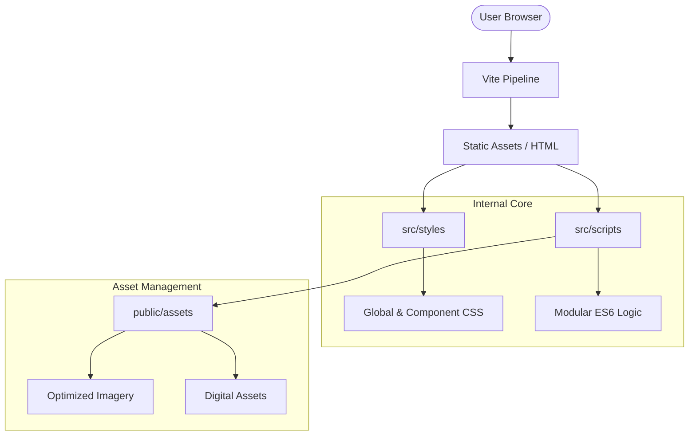
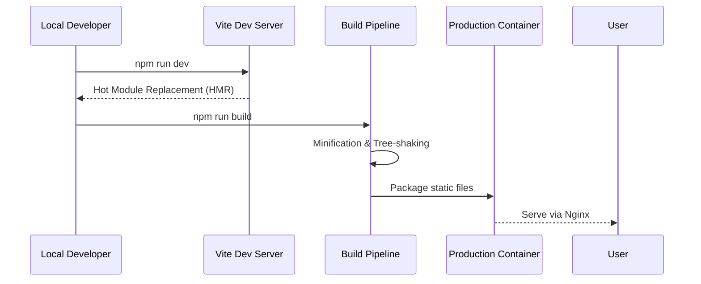
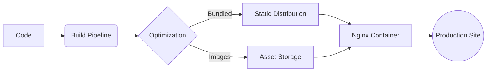

<div align="center">


# Ahmad Hassan | B-Ted Portfolio
### *Designing with Pixels, Coding with Precision*

[](https://vitejs.dev/)
[](https://github.com/AhmadHassan-BTed/B-Ted-portfolio-website)
[](https://developer.mozilla.org/en-US/docs/Web/HTML)

---

A sophisticated, high-performance portfolio repository engineered by **Ahmad Hassan (B-Ted)**. 
This project bridges the gap between complex software engineering and high-fidelity UI/UX design.

[Live Demo](https://AhmadHassan-BTed.github.io/B-Ted-portfolio-website/) • [Contact Me](contact-me.html) • [My Story](my-story.html)

</div>

<br/>

## 🏗️ Architecture Overview

The repository is structured with a focus on strict modularity and high cohesion. By separating the build-time logic from the runtime assets, the system ensures near-instantaneous load times and maintainable code boundaries.

### System Design


<br/>

## 🔄 System Workflow

The project utilizes a modern development lifecycle, transitioning from raw source files to an optimized production container.



<br/>

## 📂 Repository Structure

A carefully organized hierarchy designed for scalability and clear separation of concerns.

```text
.
├── src/
│   ├── scripts/          # Modularized JavaScript logic
│   ├── styles/           # Component-specific and Global CSS
│   └── config/           # Environment-based configuration
├── public/
│   └── assets/           # High-resolution media and artifacts
│       └── hd/           # Raw high-fidelity source assets
├── Dockerfile            # Containerization strategy
├── package.json          # Project orchestration & dependencies
├── vite.config.js        # Build-time optimization configuration
└── index.html            # Main entry point
```

<br/>

## 🚀 Technical Features

<details open>
<summary><b>🎨 High-Fidelity UI/UX</b></summary>
Polished aesthetics with fluid transitions and pixel-perfect layouts, meticulously crafted to reflect Ahmad's design philosophy.
</details>

<details>
<summary><b>⚡ Optimized Build Pipeline</b></summary>
Leveraging Vite for tree-shaking, automated bundling, and high-performance asset serving.
</details>

<details>
<summary><b>🐳 Containerization</b></summary>
Full Docker support for consistent deployment across any environment, served through a lightweight Nginx image.
</details>

<br/>

## 🛠️ Development Workflow

The project is maintained with a focus on ease of onboarding and technical trustworthiness.

### Prerequisites
- **Node.js** (v18.0 or higher)
- **Docker** (optional, for containerized testing)

### Local Setup
| Command | Description |
| :--- | :--- |
| `npm install` | Synchronize all project dependencies. |
| `npm run dev` | Initialize the reactive development server. |
| `npm run build` | Generate the optimized production bundle. |

<br/>

## 🚢 Deployment Pipeline

Data flows from the local development environment through an automated build cycle to the final production container.



<br/>

## 👤 Credits

This entire ecosystem, from the low-level architecture to the high-level design systems, was engineered and curated solely by **Ahmad Hassan (B-Ted)**. 

New collaborators or interested parties are welcomed to explore the codebase and learn more about the technical decisions behind the build.

---

<div align="center">
    <b>Designing with Pixels, Coding with Precision.</b><br/>
    <i>© 2026 Ahmad Hassan (B-Ted)</i>
</div>
